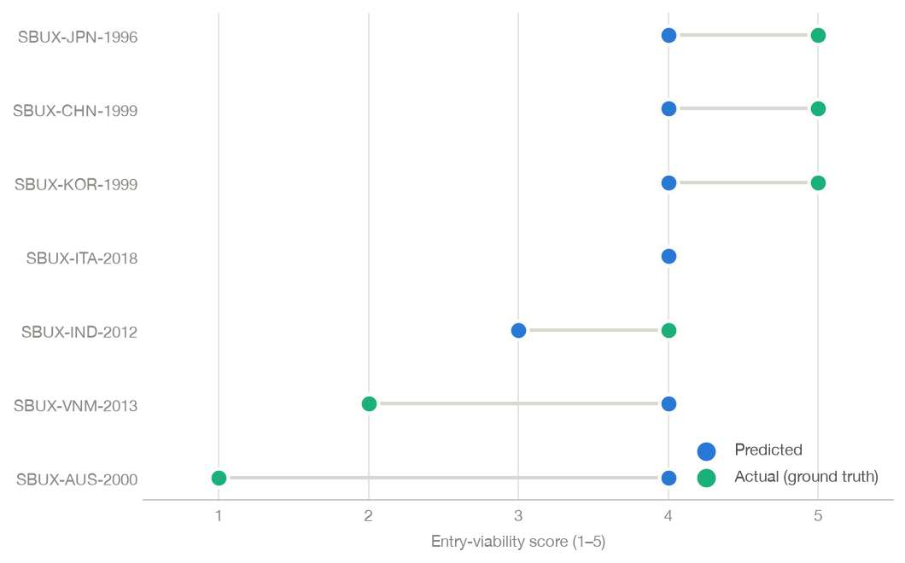

# MarketFit — Final Report

**CS 4365/6365: Introduction to Enterprise Computing — Summer 2026, Group 3**
**Alexander Moreland & Samuel Ling**
*Final documentation. Covers methods, validation results, and limitations.*

---

## 1. Problem

International market entry is one of the highest-stakes decisions a company makes when
expanding globally: Starbucks struggled for years in Italy after succeeding quickly in Japan
and China, and withdrew from Australia entirely. Existing approaches analyze the relevant
signals in isolation — consulting frameworks (qualitative, manual), trade/macro data
platforms (need interpretation), and consumer analytics like Google Trends (disconnected
from economic context). No widely accessible tool combines **historical trade performance,
macroeconomic fit, and real-time consumer demand** into one reasoning pipeline that produces
a market-entry recommendation.

**MarketFit** ingests those three signals for any `(product, market)` pair, synthesizes them
into a structured entry-viability assessment, and validates its predictions against
documented historical market-entry outcomes.

## 2. System overview

```
 UN Comtrade ──┐
 World Bank ───┼──▶ ingestion (cached) ──▶ feature engineering ──▶ scoring ──▶ 1–5 score
 Google Trends ┘         │                     (8 features,          (weighted    + success/
                    JSON disk cache             normalized)           linear)      struggle
                                                                          │
 ground-truth cases (7 documented entries) ──▶ validation harness ◀──────┘
                                                │
                                                ▼
                                   metrics · leave-one-out · error analysis
                                                │
                                                ▼
                                        Streamlit demo UI
```

| Component | Location | Owner |
|---|---|---|
| Trade ingestion (Comtrade/BACI) + macro ingestion (World Bank WDI) | `src/marketfit/ingestion/` | Alexander |
| Consumer-demand ingestion (Google Trends) + shared JSON cache | `src/marketfit/ingestion/` | Samuel |
| Ground-truth cases + success-metric definition | `src/marketfit/groundtruth/`, `data/ground_truth/` | Samuel |
| Feature engineering + scoring model | `src/marketfit/features/`, `src/marketfit/scoring/` | Alexander |
| Validation harness, metrics, error analysis | `src/marketfit/validation/` | Samuel |
| Demo UI | `app/streamlit_app.py`, `src/marketfit/demo/` | Alexander |
| Final validation + documentation | `docs/` | Samuel |

## 3. Methods

### 3.1 Data ingestion

Three clients pull and normalize the input signals, all sharing an on-disk, hash-keyed JSON
cache (`JsonCache`: namespaced, atomic writes, TTL) so the pipeline stays runnable when a
feed is throttled or down:

- **UN Comtrade** — product import flows by HS code (e.g. `0901` = coffee), reporter/partner
  M49 codes. The free tier is heavily throttled, which motivated the cache.
- **World Bank WDI** — macro indicators (GDP, GDP per capita, growth, inflation, trade
  openness, internet penetration) via the REST API.
- **Google Trends** (pytrends) — regional search interest for a demand keyword
  (e.g. "Starbucks"), as a 0–100 mean-interest snapshot.

Live pulls **degrade per signal**: an unreachable feed produces a missing signal — legitimate
scorer input — rather than a crash, and every degradation is reported.

### 3.2 Ground truth and the success metric

The shared success metric is a **1–5 entry-viability score**, aligned with four documented
outcome labels so predictions and ground truth are directly comparable:

| Outcome label | Score | Bucket |
|---|---|---|
| Strong Success | 5 | success |
| Moderate Success | 4 | success |
| Struggled | 2 | struggle |
| Withdrew | 1 | struggle |

Seven sourced Starbucks market entries are curated in
`data/ground_truth/starbucks_market_entries.csv` (each with source URL and notes):
Japan 1996, China 1999, South Korea 1999 (Strong Success); Italy 2018, India 2012
(Moderate Success); Vietnam 2013 (Struggled); Australia 2000 (Withdrew).

### 3.3 Features and scoring

Eight normalized features are built from the three signals: `market_size`,
`purchasing_power`, `growth`, `price_stability`, `openness`, `connectivity` (macro),
`existing_trade` (Comtrade), `consumer_demand` (Trends). The scorer is a **transparent
weighted linear model** (documented priors; with n=7 ground-truth cases a heavier ML model
would overfit). Weights **renormalize over the features actually present**, so a missing
signal neither drags the score down nor inflates it. The composite in [0, 1] maps to the 1–5
score; composite ≥ threshold (default 0.5) is the success bucket. The threshold can be
calibrated in-sample or per-fold.

### 3.4 Validation methodology

The harness (`marketfit.validation`) scores every ground-truth case and reports:

- **Ordinal score metrics** — MAE, RMSE, exact and within-±1 accuracy, signed bias,
  Spearman rank correlation.
- **Binary bucket metrics** — accuracy, precision, recall, F1, confusion counts
  (success = positive class).
- **Leave-one-out (LOO)** — for each case, the threshold is calibrated on the other six
  cases only; the honest small-sample estimate.
- **Error analysis** — flags bucket errors and |score error| ≥ 2, tags direction, and
  implicates features (top drivers for over-predictions, top gaps for under-predictions).

All metrics are dependency-free (stdlib), hand-verified in tests against worked examples.

## 4. Results

### 4.1 Final validation — live data

Run 2026-07-15 with real API pulls through the cached ingestion clients (20 of 21
case-signals landed; China's Trends pull was rate-limited and India's Comtrade query
returned no rows — India is a coffee producer — so those signals renormalized away):

| Case | Outcome | Actual | Predicted | Bucket correct |
|---|---|---|---|---|
| SBUX-JPN-1996 | Strong Success | 5 | 4 | ✓ |
| SBUX-CHN-1999 | Strong Success | 5 | 4 | ✓ |
| SBUX-KOR-1999 | Strong Success | 5 | 4 | ✓ |
| SBUX-ITA-2018 | Moderate Success | 4 | 4 | ✓ |
| SBUX-IND-2012 | Moderate Success | 4 | 3 | ✓ |
| SBUX-VNM-2013 | Struggled | 2 | 4 | ✗ |
| SBUX-AUS-2000 | Withdrew | 1 | 4 | ✗ |



```
Score (1-5):  MAE=1.29  RMSE=1.56  exact=14%  within-1=71%  bias=+0.14  rank_rho=+0.11
Bucket:       acc=71%  precision=0.71  recall=1.00  F1=0.83  (TP=5 FP=2 FN=0 TN=0)
LOO bucket:   acc=57%  precision=0.67  recall=0.80  F1=0.73
```

### 4.2 Fixture run (offline, reproducible)

The bundled fixtures (`data/fixtures/country_signals.json`) give the deterministic run used
by tests and the demo: MAE 1.29, within-1 71%, rank ρ +0.60; bucket accuracy 71%
(precision 0.71, recall 1.00); **LOO 43%**. Live data *improved* LOO from 43% → 57% and
produced the first exact score match (Italy), while the headline in-sample numbers held.

### 4.3 The baseline confrontation

The ground truth is 5 successes / 2 failures, so a trivial model that always predicts
"success" scores **71%** bucket accuracy. Our in-sample accuracy equals that baseline
(the model predicts success for all 7 cases), and LOO is below it. **The current model does
not yet beat the majority-class baseline on classification.** Where it adds value is
*ordering*: on fixtures it ranks markets in nearly the right order (ρ +0.60), and on both
runs every documented success scores ≥ its documented struggles. The 1–5 score is
informative; the success/struggle cut is not yet.

### 4.4 Error analysis — why the model misses

Both runs miss the **same two cases in the same direction**: Vietnam (predicted 4, actual 2)
and Australia (predicted 4, actual 1) are over-predicted. The implicated features are
`market_size`, `purchasing_power`, and `openness`/`existing_trade` — i.e. the model rewards
big, rich, open markets, and both failures happened in exactly such markets **against
entrenched local coffee cultures** (Vietnamese café culture; Melbourne espresso culture).
The model has no feature that can push a rich, big market *down*. This is the concrete
next-iteration signal: a competitive-intensity / category-maturity feature.

## 5. Limitations

1. **n = 7.** One flipped case swings bucket accuracy by 14 points; all aggregate metrics
   carry wide uncertainty. The set must grow (more Starbucks markets, plus non-coffee cases
   such as Netflix regional launches) before the numbers are statistically defensible.
2. **Temporal mismatch.** Input signals are current (2022–2026 pulls), while the entries
   occurred 1996–2018. The validation therefore tests "would this market fit *today*,"
   not "as of the entry year." Historical WDI/Comtrade snapshots keyed to `entry_year`
   would fix this; Google Trends only reaches back to 2004.
3. **Single company, single product category.** All cases are Starbucks/coffee; results may
   not generalize (the planned Netflix cases also probe the no-trade-signal path).
4. **No competition feature** — the diagnosed cause of both misses (§4.4).
5. **LLM rationale not wired.** The scorer exposes per-feature contributions ready for
   prompt-based prose generation; by design the LLM would *explain* the deterministic
   score, never re-decide it. Deferred as the pipeline is fully interpretable without it.

## 6. Future work

- Add a competitive-intensity / category-maturity feature (e.g. per-capita product imports,
  incumbent density) — directly targets both observed misses.
- Grow ground truth past n=7 with sourced non-Starbucks cases.
- Year-anchored historical signals to remove the temporal mismatch.
- LLM rationale generation (explainer, cached, never a decider).
- Retry/backoff in the ingestion clients (Trends rate-limits and WB timeouts were the only
  live-run degradations; both recovered on a single retry).

## 7. Reproducibility

```bash
python -m venv .venv && source .venv/bin/activate
pip install -r requirements.txt
python -m pytest tests/            # 34 tests, all offline
python scripts/demo_validation.py  # deterministic validation run (fixtures)
streamlit run app/streamlit_app.py # demo UI (fixtures or live mode)
```

Everything above runs without network access except the UI's live mode. The test suite
covers ingestion (cache-seeded, hermetic), ground-truth loading/validation, feature
engineering, scoring, the validation harness/metrics/error analysis (hand-computed
expectations), and the demo helpers.

**Repository:** https://github.com/Sling38/IEC-Project
